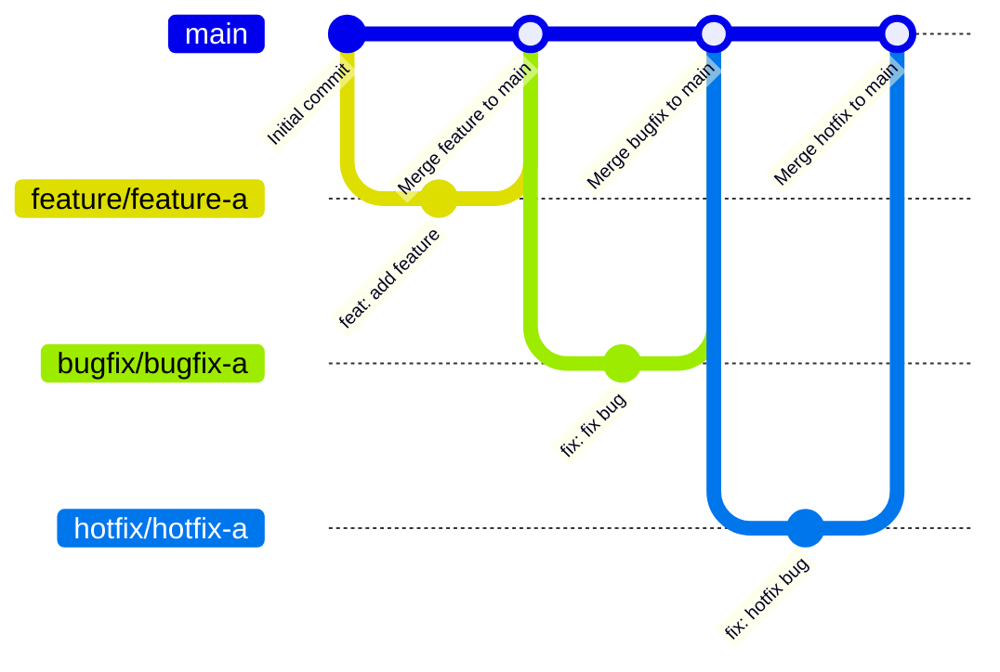

# コントリビューションガイドライン

Thank you for contributing!

コントリビューターの方は、次のガイドラインに沿ってコントリビュートしてください。

- [ブランチ戦略](#ブランチ戦略)
- [コミットメッセージ規約](#コミットメッセージ規約)

## ブランチ戦略

ブランチは、GitHub flowを基にした次のようなフローで運用しなければなりません。



使用できるブランチの一覧と各ブランチの用途及び運用ルールは次のとおりです。

| ブランチ | 用途 | 運用ルール |
|-----------|------|-----------|
| **`main`** | 🛡️ 本番環境 | ・直接プッシュ禁止<br>・削除禁止<br>・プルリクエスト経由でのみ更新 |
| **`feature/<feature-name>`** | 🌱 機能開発 | ・`main`から作成<br>・完了後にプルリクエストを作成し`main`へマージ<br>・マージ後は削除 |
| **`bugfix/<bugfix-name>`** | 🔧 バグ修正 | ・`main`から作成<br>・修正後にプルリクエストを作成し`main`へマージ<br>・緊急性が高い場合は`hotfix`を使用<br>・マージ後は削除 |
| **`hotfix/<hotfix-name>`** | ⚡ 緊急のバグ修正（本番障害・重大不具合等） | ・`main`から作成<br>・修正後にプルリクエストを作成し`main`へマージ<br>・マージ後は削除 |

ブランチ名の`<feature-name>`、`<bugfix-name>`及び`<hotfix-name>`には、英小文字（a–z）、数字（0–9）及びハイフン（-）以外を使用してはなりません。

## コミットメッセージ規約

コミットメッセージは、[Conventional Commits 1.0.0](https://www.conventionalcommits.org/ja/v1.0.0/)の仕様を基にした次のような形にしなければなりません。

```
<type>[optional scope]: <description>

[optional body]

[optional footer(s)]
```

使用できる`<type>`の一覧と各`<type>`の説明は次のとおりです。

| `<type>` | 説明 |
|----------|------|
| **`build`** | 🛠️ ビルドシステムや外部依存関係に影響する変更 |
| **`chore`** | ♻️ プログラム本体やテスト以外の変更 |
| **`ci`** | ⚙️ CI設定ファイルやスクリプトの変更 |
| **`docs`** | 📚 ドキュメントのみの変更 |
| **`feat`** | ✨ 新機能 |
| **`fix`** | 🐛 バグ修正 |
| **`perf`** | 🚀 パフォーマンスを改善するコード変更 |
| **`refactor`** | 📦 バグ修正や機能追加ではないコード変更 |
| **`revert`** | 🗑️ 以前のコミットを取り消す変更 |
| **`style`** | 💎 コードに影響を与えない変更（空白、フォーマット、セミコロン不足等） |
| **`test`** | 🚨 不足しているテストの追加又は既存テストの修正 |

`<description>`は、先頭を小文字とし、英語の命令形で簡潔に記載しなければなりません。また、末尾にピリオドを付けてはなりません。

許容されるコミットメッセージの例は次のとおりです。

```
feat: add support for additional data formats
```

```
fix: correct incorrect validation logic
```

```
docs: add installation guide for new users
```
